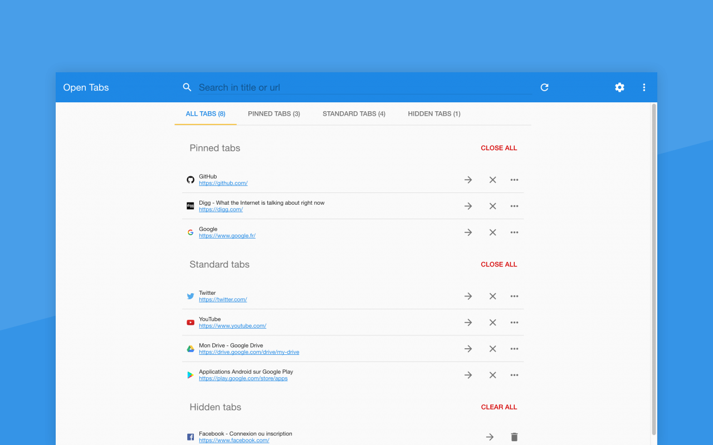

#  Open Tabs

Show open tabs.

[](https://travis-ci.org/sylouuu/chrome-open-tabs)
[](https://david-dm.org/sylouuu/chrome-open-tabs#info=devDependencies)

## Features

* Go to tab
* Close tab
* Reload tab
* Duplicate tab
* Pin/unpin tab
* Hide tab

The open tabs are updated in real time.

## Why?

I wanted to find an extension that shows opened tabs in an elegant ways but didn't find it. Hope you will like Open Tabs.

## Installation

Install from the **[Chrome Web Store](https://chrome.google.com/webstore/detail/open-tabs/cepfpldhbcfaklnnldhoaahgliijehap)**.

Also available for **[Opera Browser](https://addons.opera.com/fr/extensions/details/open-tabs/)**.

## Usage

* Click on the  icon to open.
* Try & enjoy!

## Screenshot



## Changelog

See [releases](https://github.com/sylouuu/chrome-open-tabs/releases) section.

## Development

In case you want to contribute or just want to play with the code, follow the guide.

### Setup

Download and install [NodeJS](http://nodejs.org/download/) to get [npm](https://www.npmjs.org/).

Install `gulp` globally:

```bash
sudo npm install -g gulp
```

Clone the project and install dependencies with `npm install`.

Type `gulp` to watch your changes inside `src/` folder or type `gulp build` after each change.

### Load your local extension in Chrome

Go to `chrome://extensions/` and enable the "Developer mode".

Click on "Load unpacked extension..." and select the project `dist/` folder.

## License

See [license](LICENSE.md) file.
